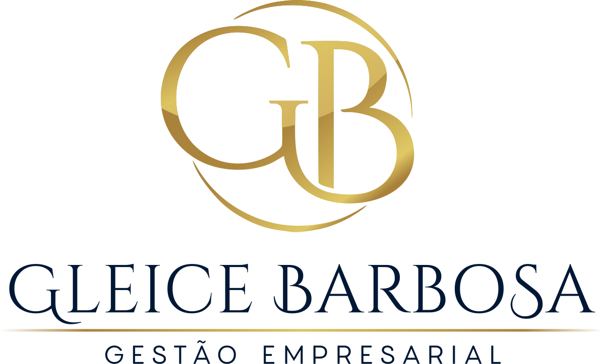

# Gleice Barbosa - Web Site Portfolio

Um site de portfólio moderno e responsivo para uma gestora de empresas chamada Gleice Barbosa, criado com HTML5, CSS3 e JavaScript vanilla.

## Visão Geral

O site é um site informativo sobre o trabalho e informações profissionais sobre suas profissões e informações. Em uma forma de apresentar seus trabalhos já realizados, oferecimento de serviço, venda de curso próprio, palestras e eventos realizados e que serão realizados pela pessoa.

## Estrutura montada para o projeto

### Design Moderno
- **Cores**: _**Tema Azul escuro & Dourado**_ Paleta de cores pensada a gosto do cliente com gradientes dinâmicos;
- **Tipografia**: Fontes Poppins e Inter;
- **Animações Fluidas**: Fades In suaves e efeitos hover;
- **Elementos**: Icones representativos para àrea de atuação.

### Totalmente Responsivo
- **Responsividade:** Responsividade aplicada para diversas telas como: Tablet, Celulares e Computadores.

## Telas do Web Site

### **Home/Hero**
- Apresentação da marca/pessoa
- Meio de contato para comunição

### **About Me**
- História e missão da empresa
- Estatísticas impressionantes animadas
- Grid responsivo com informações-chave

### **Portfólio**
- Showcase de projetos desenvolvidos
- Filtros por plataforma (Mobile, PC, Web)
- Cards interativos com overlays
- Links para demonstrações

### **Serviços**
- Grid de serviços oferecidos
- Cards com ícones Font Awesome
- Efeitos hover sofisticados
- Descrições detalhadas

### **Contato**
- Formulário funcional com validação
- Informações de contato completas
- Links para redes sociais
- Sistema de notificações

## Tecnologias Utilizadas

| Tecnologia | Versão | Descrição |
|------------|--------|-----------|
|  | 5 | Estrutura semântica |
|  | 3 | Estilos e animações |
|  | ES6+ | Interatividade |

## Compatibilidade

### Navegadores Suportados
- ✅ Chrome 90+
- ✅ Firefox 88+
- ✅ Safari 14+
- ✅ Edge 90+

### Dispositivos Testados
- **Mobile**: 320px - 768px
- **Tablet**: 768px - 1024px
- **Desktop**: 1024px+

## Performance

### Métricas de Desempenho
- **First Contentful Paint**: < 1.5s
- **Largest Contentful Paint**: < 2.5s
- **Cumulative Layout Shift**: < 0.1
- **First Input Delay**: < 100ms

### Otimizações Aplicadas
- Imagens otimizadas
- CSS e JS minificados (produção)
- Lazy loading de imagens
- Design mobile-first

## Contato

**Gleice Barbosa**
- 🌐 Website: 
- 📧 Email: agleicebarbosa@gmail.com

---

**Desenvolvido por: Gabriel Víctor & Thiago R.**

**© 2023 - 2025 Gleice Barbosa. Todos os direitos reservados.**

